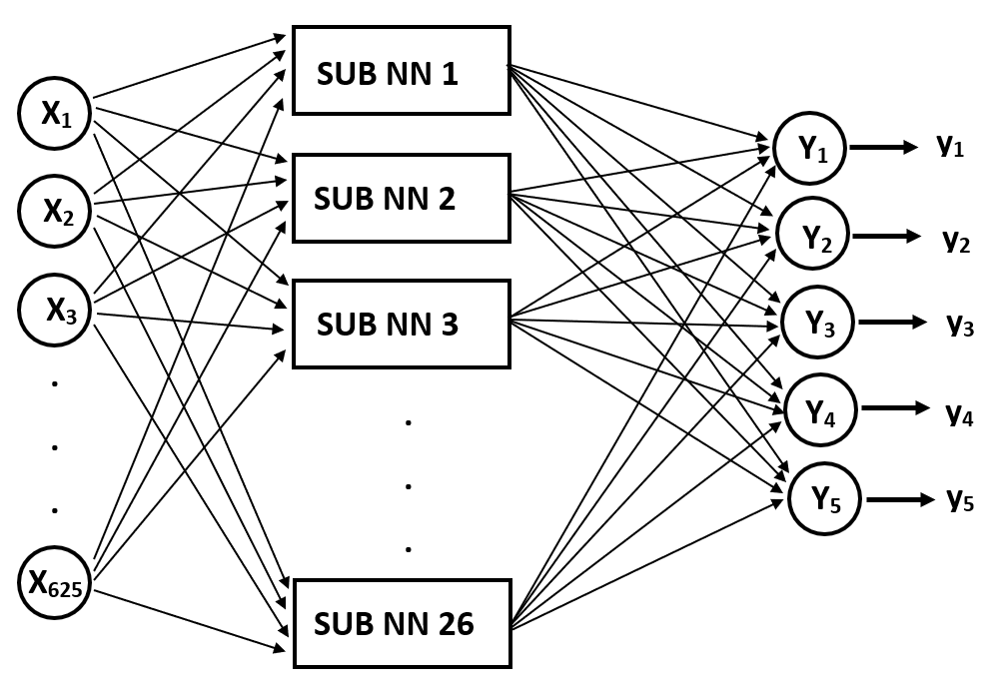
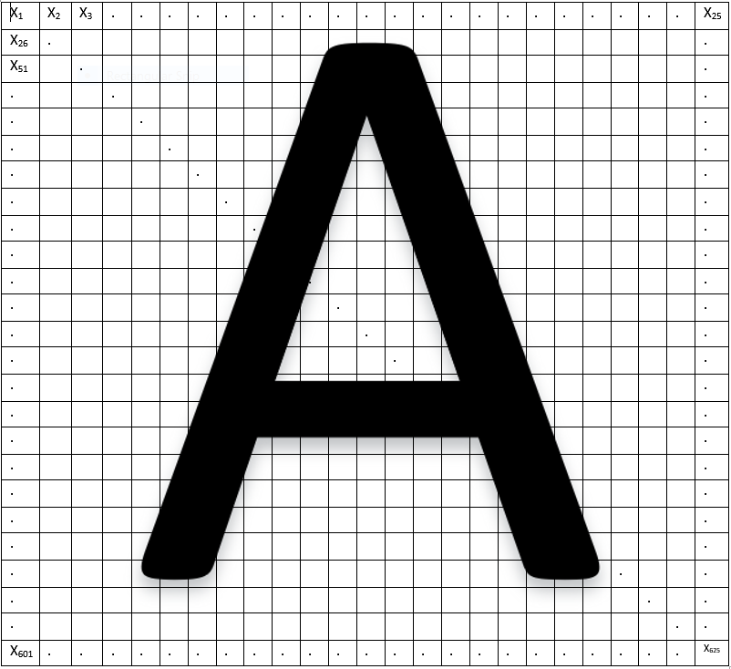

Handwritten Character Recognition by Supervised Learning of a Neural Network
==========

# Abstract
Machine learning related fields are one of the latest emerging areas in engineering and can be easily utilized to implement and describe complex logical systems in mathematical form. Neural network is one of the most fundamental tools in machine learning which is used to realize various complex logical mapping inspired by human brain.
    
Human brain is capable of recognizing various letters, characters, symbols with some amount of training. Our project is inspired by the ability of brain to classify the characters. In this project, our objective is to implement a neural network to recognize and classify English letters. A simple collection of feed forward neural networks with sufficient amount of training data set is proposed to achieve this challenging task. The main reason to choose feed forward neural network for this particular application is, they are easy to code and train. However, we still need to overcome the problem of local minima and relatively long time of training. For that, techniques such as dimension reduction of training data set could be effectively utilized.
    
A modified version of feed forward neural network architecture is proposed to overcome the local minima issue (up to some extent), and is described in details in the Methodology section. MATLAB will be used to implement the algorithm and train on a given/available training data set.

# Block Diagram (Main NN)
 

# Block Diagram (Sub NN)
Proposed neural network has 26 sub neural networks. Each sub network is trained to identify a single character. Each sub network have two hidden layers and single output. The output will give more than 0.5 if the input vector is related to corresponding letter. This method will be helpful to mitigate the errors while implementing and hopefully reduce the effect of local minima. Each input neurons of the sub net is connected to all 625 weights.

[Click here](assets/block_diagram_subnn.png)

# Pixcel Map
According to the following figure, the input vector to the neural network consists of 625 elements. Each element of the input vector is a element of 2D array which maps the gray scale value of the handwritten character. Handwritten characters are first mapped to  gray scale and then divided to 25x25 pixels. Each element of this 2D array will then map between 0 and 255 according to the intensity of each pixel.

